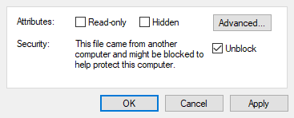

# Error handling  
  
One thing there will course an error is. If Revit is running while installing, then will it work the first time Orchid is installed (after a restart of Dynamo), next time Orchid is being "upgraded" while Dynamo is running or has been started and Revit is still running, then will it fail. This is due to applications in Windows environment read the needed assemblies (DLL files) when the application is opened. Windows will then protect these files from being changed unless they explicitly are unprotected. Unprotecting files could course other unintended issues and this is why Dynamo and Revit need to be closed during the installation of Orchid.  
Do always ensure Revit (and Dynamo) is closed during installation!  
  
### Dynamo package path  
The executable installer will install Orchid in the default user path for dynamo packages. If you want to move the default location for packages, then put the path you want to use as the first path. This may also include network and unc paths!  
  
Please note that the ”numbered” version of Orchid will be installed into the numeric folder that reflects the version. This means that Orchid 219 will be installed in the 2.19 packages path, even if it is installed in a Dynamo 2.18 version, and it might not be loaded because of this.  
This issue can be resolved by adding the needed path manually or by moving the Orchid package manually.  
  
### Errors coursed by improper packages 
If a package is shipped including Dynamo assemblies, then will packages fail if dependencies for a specific version of Dynamo exist in the package. Orchid is written for specific versions due to the enormous scope of Orchid. This kind of error happens on rare occasions, however, if it happens, it seems to be if package builders are new to coding and the community. They might not know that this will involve unintended behavior in Dynamo. All packages should be shipped without any Dynamo assemblies, let Dynamo handle its assemblies. All serious packages are shipped without Dynamo assemblies.  
This can usually be ascertained by moving all other packages out of the package path so that nothing but Dynamo works, and then moving package by package back... starting with Orchid, since this will let you know that it works!  
  
### Errors coursed by the IFC Exporter 
Orchid nodes for the IFC Exporter is also version-specific. Please ensure that you are using the latest released version for your Revit version. The latest IFC Exporter that can be found at
[github.com/Autodesk/revit-ifc](http://github.com/Autodesk/revit-ifc).  
  
If Orchid is installed using the executable, then a dynamic function will verify if the proper IFC Exporter is installed. If not, then no nodes for IFC will occur. If the IFC Exporter at a later stage is being installed, the dynamic function will change the loading process, however, the first time after installing will the loading process add the IFC nodes manually. This will give the error that it looks like the nodes are not loaded. This is not true, the nodes will work. A simple restart of the Dynamo platform will solve the problem, while the dynamic loader function also will add loading in the future to the pck.json file, and hereafter will the error not occur anymore.  
If the IFC Exporter is being uninstalled, the dynamic function will also reverse the access for the IFC nodes, this will also require a restart of Dynamo before it works without any errors.  
  
### Errors coursed by Windows  
A well-known "error" is Windows zip tool blocking files upon download, due to permission set on your machine. Files that are meant to be placed in system folders like %ProgramData% and %AppData% may be blocked, if so, then unblock the files, by entering the 'Properties' -> 'Unblock' menu item. However, using [7zip]( https://www.7-zip.org/download.html) as your zip tool instead can solve the problem, since this tool offers unblocking while unzipping.  
  
  
### Other challenges  
In the last couple of years have many things changed in Revit, old methods change names and functions, new methods arrive, and some methods are being deprecated. Also, Dynamo is concurrently being developed which in itself involves challenges.  
However, the largest challenge is the development of the Orchid package. The package is constantly expanding and the amount of new methods is huge. This involves challenges for the organization of nodes in the package, which are being reorganized when there is no other way around to keep the progress of Orchid development.  
  
### Further information  
For more information about manual installations and issues using Dynamo, please see the [Dynamo Builds]( https://github.com/DynamoDS/Dynamo/wiki/How-to-Utilize-Dynamo-Builds) wiki page or the [Help Center](https://dynamobim.org/help-center/) page.  
